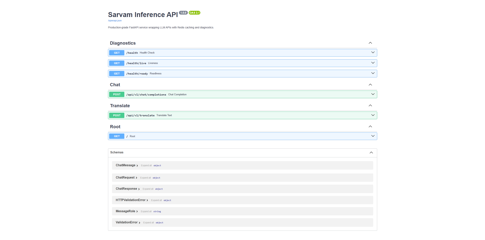

# Sarvam Inference API

Production-grade FastAPI inference gateway for Large Language Model (LLM) APIs with Redis-backed caching, diagnostics, rate limiting, and containerized deployment.

Built to simulate scalable AI inference infrastructure workflows similar to modern GenAI backend systems.

---

# Features

- Async FastAPI backend architecture
- Redis-based response caching
- Request rate limiting
- Health, liveness, and readiness diagnostics
- Middleware request logging
- Retry handling for upstream LLM APIs
- Dockerized deployment with Docker Compose
- Typed request/response validation using Pydantic
- OpenAPI / Swagger documentation

---

# Tech Stack

- FastAPI
- Python
- Redis
- Docker
- Uvicorn
- HTTPX
- Pydantic
- Tenacity

---

# Architecture

```text
Client
   ↓
FastAPI API Gateway
   ↓
Redis Cache Layer
   ↓
LLM API Provider
   ↓
Response Pipeline
```

---

# API Documentation

Swagger/OpenAPI docs:

```text
http://localhost:8000/docs
```

## Swagger UI



---

# Health Diagnostics

Supports:
- `/health`
- `/health/live`
- `/health/ready`

## Health Endpoint


---

# Run Locally

## Clone Repository

```bash
git clone https://github.com/rahulrenjith/sarvam-inference-api.git
cd sarvam-inference-api
```

---

## Create Environment File

```bash
cp .env.example .env
```

Add your API key inside `.env`:

```env
OPENAI_API_KEY=your_api_key
REDIS_URL=redis://redis:6379
```

---

# Local Development

Install dependencies:

```bash
pip install -r requirements.txt
```

Run development server:

```bash
uvicorn app.main:app --reload
```

---

# Docker Deployment

Run full stack:

```bash
docker compose up --build
```

This starts:
- FastAPI container
- Redis container

---

# Sample Request

```bash
curl -X POST http://localhost:8000/api/v1/chat/completions \
-H "Content-Type: application/json" \
-d '{
  "messages": [
    {
      "role": "user",
      "content": "Hello"
    }
  ]
}'
```

---

# Project Structure

```text
app/
├── core/
├── models/
├── routers/
├── services/
├── main.py

assets/
├── swagger.png
├── health.png

Dockerfile
docker-compose.yml
requirements.txt
README.md
```

---

# Future Improvements

- Streaming LLM responses
- Prometheus metrics integration
- Kubernetes deployment
- Vector database integration
- Observability dashboards
- Multi-model routing

---

# Author

Rahul Renjith
